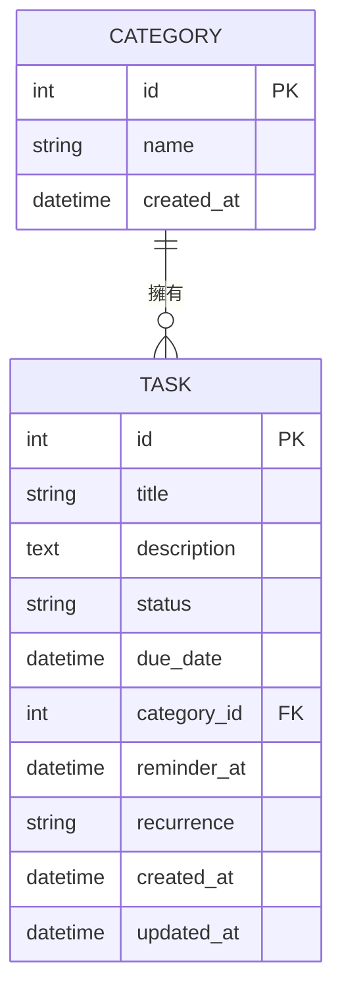

# 資料庫設計 (Database Design)

本文件根據 PRD、系統架構與流程圖，定義任務管理系統所需的 SQLite 資料表結構、欄位型別與關聯。

---

## 1. ER 圖（實體關係圖）

### 關聯說明

- **CATEGORY ↔ TASK**：一對多。一個分類可以包含多個任務，每個任務只能屬於一個分類（或不分類）。

---

## 2. 資料表詳細說明

### 2.1 categories — 分類表

用於管理任務的分類（如：工作、日常、休閒）。

| 欄位名稱     | 型別     | 必填 | 說明                              |
| :----------- | :------- | :--- | :-------------------------------- |
| `id`         | INTEGER  | ✅    | 主鍵 (PK)，自動遞增              |
| `name`       | TEXT     | ✅    | 分類名稱，不可重複                |
| `created_at` | TEXT     | ✅    | 建立時間，ISO 8601 格式，預設為現在 |

### 2.2 tasks — 任務表

儲存所有任務的核心資料表。

| 欄位名稱      | 型別    | 必填 | 說明                                                         |
| :------------ | :------ | :--- | :----------------------------------------------------------- |
| `id`          | INTEGER | ✅    | 主鍵 (PK)，自動遞增                                         |
| `title`       | TEXT    | ✅    | 任務標題，不可為空                                           |
| `description` | TEXT    | ❌    | 任務詳細描述                                                 |
| `status`      | TEXT    | ✅    | 任務狀態，預設為 `'pending'`。可選值：`pending` / `completed` |
| `due_date`    | TEXT    | ❌    | 截止日期時間，ISO 8601 格式（用於日曆檢視與排序）            |
| `category_id` | INTEGER | ❌    | 外鍵 (FK)，關聯到 `categories.id`                            |
| `reminder_at` | TEXT    | ❌    | 提醒時間，ISO 8601 格式                                      |
| `recurrence`  | TEXT    | ❌    | 重複週期。可選值：`none` / `daily` / `weekly` / `monthly`    |
| `created_at`  | TEXT    | ✅    | 建立時間，ISO 8601 格式，預設為現在                          |
| `updated_at`  | TEXT    | ✅    | 最後更新時間，ISO 8601 格式，預設為現在                      |

---

## 3. SQL 建表語法

完整的建表 SQL 請參見 `database/schema.sql`。

---

## 4. Python Model 程式碼

Model 檔案位於 `app/models/` 目錄下：

| 檔案               | 說明                                 |
| :----------------- | :----------------------------------- |
| `__init__.py`      | 資料庫初始化與連線管理               |
| `category.py`      | Category Model，包含 CRUD 方法       |
| `task.py`          | Task Model，包含 CRUD 方法與查詢邏輯 |

每個 Model 皆提供以下標準方法：
- `create()` — 建立一筆新紀錄
- `get_all()` — 取得所有紀錄
- `get_by_id(id)` — 依 ID 取得單筆紀錄
- `update(id, ...)` — 更新指定紀錄
- `delete(id)` — 刪除指定紀錄

Task Model 額外提供：
- `get_by_date(date)` — 依日期查詢任務（月曆用）
- `get_by_category(category_id)` — 依分類查詢任務
- `toggle_status(id)` — 切換任務完成狀態
