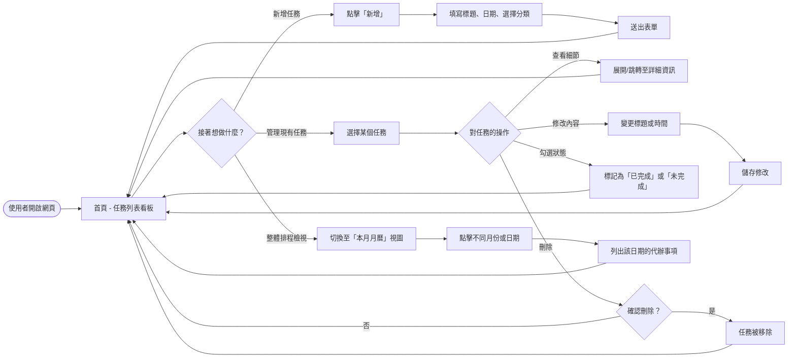
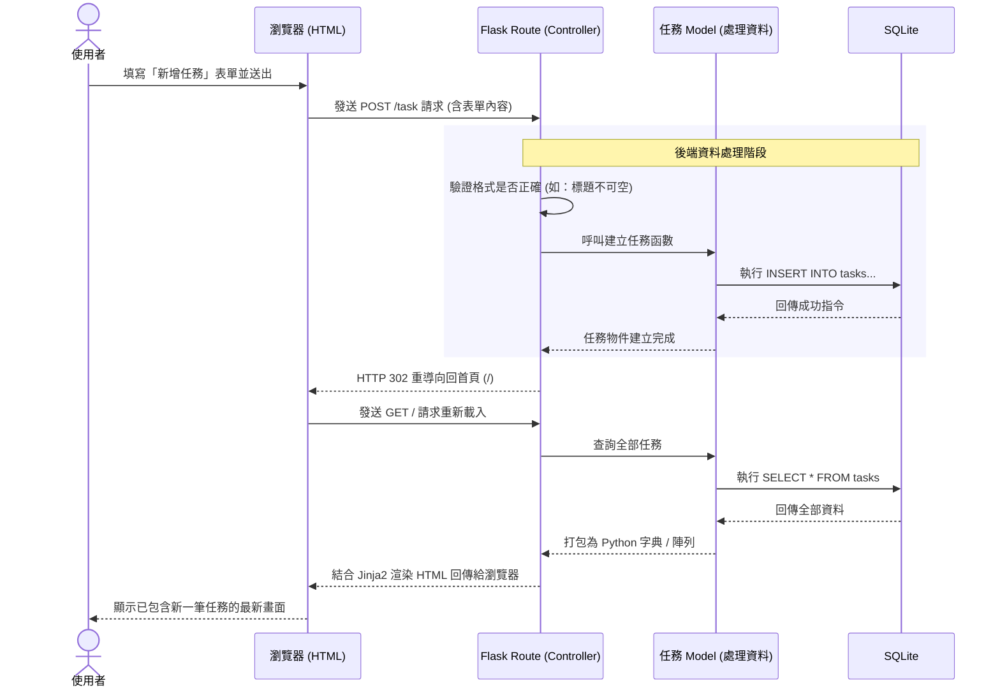

# 系統流程圖與使用者操作路徑 (Flowchart & Sequence)

本文件根據 PRD (任務管理系統) 與系統架構文件所繪製，用於視覺化展現系統的使用者操作動線與後端資料處理流程。

## 1. 使用者流程圖 (User Flow)

描述使用者進入任務管理系統後，可以進行的各種操作與頁面跳轉邏輯。

## 2. 系統序列圖 (Sequence Diagram)

此圖描述當使用者欲「新增一個新任務」時，系統從前端至後端、乃至資料庫的完整互動經過。

## 3. 功能清單與路徑對照表

這是未來開發路由時的對照清單，用來指引每個功能分別由哪個網址和 HTTP Method 來處理。

| 功能區塊 | 操作行為 | 網址路徑 (URL Context) | HTTP Method | 對應的動作與頁面 |
| :--- | :--- | :--- | :--- | :--- |
| **瀏覽介面** | **查看首頁任務列表** | `/` | `GET` | 渲染 `index.html`。回傳預設/當日列出的任務 |
| **瀏覽介面** | **查看月曆視圖** | `/calendar` | `GET` | 渲染 `calendar.html`。回傳月曆所需的結構與資料 |
| **任務操作** | **新增任務** | `/task` | `POST` | 寫入資料庫，完成後重導回 `/` |
| **任務操作** | **更新任務內容** | `/task/<test_id>` | `POST` *(或 PUT)* | 寫入變更至指定任務，完成重導回原處 |
| **任務操作** | **刪除任務** | `/task/<task_id>/delete`| `POST` | 從資料庫移除指定任務，重導回 `/` |
| **任務操作** | **切換任務狀態** | `/task/<task_id>/toggle`| `POST` | 將指定任務設為完成或未完成，重導回 `/`|
| **進階輔助** | *(若需用前端 JS 抓單日資料)*| `/api/tasks` | `GET` | 回傳特定日期的 JSON 格式，搭配 URL 參數 `?date=YYYY-MM-DD` |
